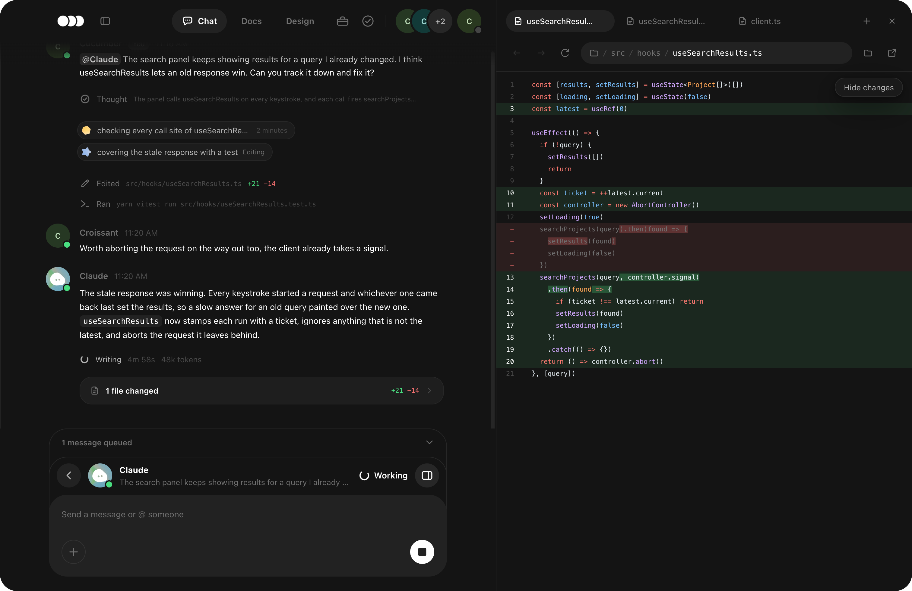

<p align="center">
  <picture>
    <source media="(prefers-color-scheme: dark)" srcset="images/mark-on-dark.png" />
    
  </picture>
</p>

<p align="center">
  Pool LLMs with friends.
</p>

<h3 align="center">
  <a href="https://github.com/JamelHammoud/crew/releases/latest">Download for Mac</a>
  ·
  <a href="https://github.com/JamelHammoud/crew/releases/latest">Download for Windows</a>
</h3>

<p align="center">
  Apple silicon · Windows x64
</p>

We built Crew so we could work on projects together and pool the LLMs on our machines. Open a folder, add the model CLIs you already use, and share the crew when you want someone else in.

Each agent uses its owner's signed-in CLI account. Chat, docs, design, tasks, tools, and memory stay with the project and sync through git.



## Start

1. Download Crew and open it.
2. Open a project folder.
3. Open **Agents** from your face in the top right and add Claude, Codex, Kimi, or Grok.
4. Write a message and `@` the agent you want.

Crew can install a missing CLI when you add an agent. The Mac build is signed and notarized. Windows may ask you to confirm the unsigned installer.

## Run a crew on your own

- Run several threads at once and pop any thread into its own window.
- Let an agent send focused work to helpers while it keeps going. Every helper has a live thread, can run on another CLI, and can send helpers of its own.
- Use `/tickets` for work that belongs on a board. Answer questions, follow decisions, approve a finished ticket, or send it back with a note.
- Use `/plan` to see the approach before changes, `/goal` to keep going until the work is done, and `/fallback` to name the agent that takes over after a failed run.
- Steer a live turn, queue the next message, ask a side question with `/btw`, or continue from any message with `/fork`.
- Give every agent the same project notes through shared memory.
- Read the full trail in the thread, including commands, helper work, diffs, tests, time, tokens, and cost.

Type `/` in any composer to see every way a thread can run.

## Keep the work beside the chat

- The panel beside a thread opens project files, live diffs, web pages, terminals, plans, Boards, helpers, and Review in tabs.
- **Review** stages files, inspects changes, commits, pulls, pushes, and puts work aside.
- **Docs** and **Design** give the crew shared pages and boards that agents can read and change.
- **Tasks** holds work for people and agents. **Toolbox** turns common actions and chains into shared buttons.
- **Huddle** carries voice, video, and screen sharing. **Voice** starts an agent thread from a conversation. **Scribe** writes into any field on your computer.
- **Files** previews the usual project and attachment formats. Music, playlists, Falling Blocks, and Birdie are shared with the crew too.

## Bring someone in

Open **People** in settings and turn on **Anyone with the link can join**. When someone joins, their agents appear beside yours and can work in the same project.

Crew can keep `.crew` in the project, in the Crew app, or in a separate repo. Pick the project when the conversation should travel with the code. Pick a separate repo when the code can be public and the crew should stay private.

## Open Crew from a terminal

```text
crew                                 open a crew here
crew ~/code/thing                    open one there
crew --share                         let people on your network in
crew --join crew://host:port/code    join a crew in this folder
```

**This computer** in settings puts `crew` on PATH. Run `crew --help` for every option.

## Build from source

Crew needs Node 22 and Yarn 1.22.

```sh
yarn
yarn dev
```

`yarn build` builds the app. `yarn dist` packages it. `yarn test tests/<name>.test.ts` runs one suite. `yarn tsc --noEmit` checks the types.

Problems and ideas belong in [Issues](https://github.com/JamelHammoud/crew/issues).

## License

MIT. See [LICENSE](LICENSE).
